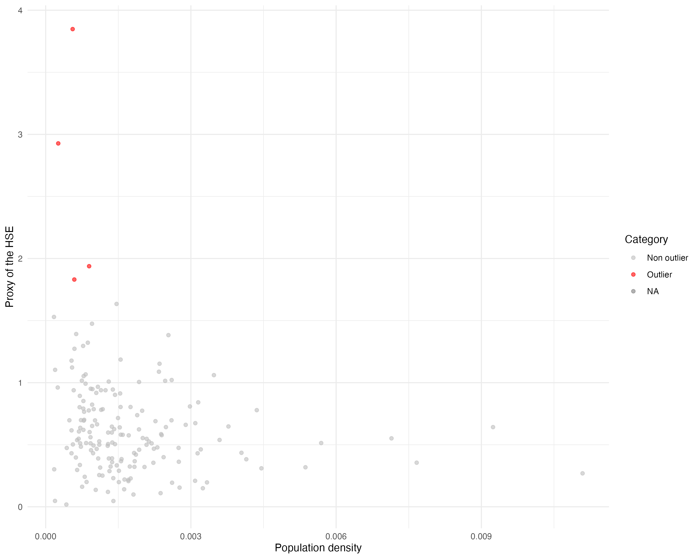

# Introduction

This report studies housing supply elasticity in Spain using a proxy based on urban land availability.

The intuition is simple: municipalities with more potentially buildable urban land relative to already built surface should be able to expand housing supply more easily after a demand shock. Conversely, municipalities with little available urban land may face stronger supply constraints.

The analysis focuses on Spanish municipalities and autonomous communities over the period 1994–2024.

# Data and proxy construction

The dataset combines cadastral information on urban land with municipal geographic boundaries.

The main housing supply elasticity proxy is defined as:

$$
HSE_{it} = \frac{\text{Potentially buildable urban land}_{it}}{\text{Built urban surface}_{it}}
$$

where $begin:math:text$i$end:math:text$ denotes the municipality and $begin:math:text$t$end:math:text$ denotes the year.

The dataset includes:

- municipality and autonomous community identifiers;
- built urban surface;
- total urban surface;
- potentially buildable urban land;
- yearly values of the HSE proxy.

Spatial data are added using the `mapSpain` package in R.

# Outlier analysis

The distribution of the proxy contains some extreme values, especially among low-density municipalities. These observations may reflect very small built surfaces or municipalities with unusually large amounts of available land.

```{r}

```

# Housing supply elasticity in 2024

The first set of maps describes the spatial distribution of the HSE proxy in 2024.

The top 2% of values are treated as outliers in order to make the spatial pattern more readable.

```{r}
knitr::include_graphics("outputs/figures/outliers_2024.png")
```

After excluding outliers, the municipal-level map provides a clearer view of the geographic distribution of the proxy.

```{r}
knitr::include_graphics("outputs/figures/ratio_2024_no_outliers.png")
```

At the autonomous community level, municipal ratios are aggregated using total urban surface as weight:

$$
WR_i = \frac{\sum_{j \in M_i} r_j s_j}{\sum_{j \in M_i} s_j}
$$

where $begin:math:text$M\_i$end:math:text$ is the set of municipalities in autonomous community $begin:math:text$i$end:math:text$, $begin:math:text$r\_j$end:math:text$ is the municipal HSE proxy, and $begin:math:text$s\_j$end:math:text$ is the municipal total urban surface.

```{r}
knitr::include_graphics("outputs/figures/ratio_2024_ccaa.png")
```

# Changes over time

The report also studies the evolution of the HSE proxy across four-year periods from 1995 to 2023.

For the HSE proxy, changes are measured in percentage points:

$$
\Delta HSE_{it} = (HSE_{it} - HSE_{i,t-4}) \times 100
$$

```{r}
knitr::include_graphics("outputs/figures/hse_variation_municipal.png")
```

The same exercise is repeated at the autonomous community level.

```{r}
knitr::include_graphics("outputs/figures/hse_variation_ccaa.png")
```

# Built surface and total urban surface

To complement the elasticity proxy, the report analyzes the evolution of built surface and total urban surface.

For these variables, the yearly growth rate over each four-year period is computed as:

$$
g_{it} = \frac{1}{4} \left(\ln X_{it} - \ln X_{i,t-4}\right) \times 100
$$

where $begin:math:text$X\_\{it\}$end:math:text$ is either built surface or total urban surface.

## Built surface

```{r}
knitr::include_graphics("outputs/figures/built_variation_municipal.png")
```

```{r}
knitr::include_graphics("outputs/figures/built_variation_ccaa.png")
```

## Total urban surface

```{r}
knitr::include_graphics("outputs/figures/totsurf_variation_municipal.png")
```

```{r}
knitr::include_graphics("outputs/figures/totsurf_variation_ccaa.png")
```

# Conclusion

The analysis shows substantial spatial heterogeneity in housing supply elasticity across Spain. Municipalities and regions differ significantly in the availability of developable urban land relative to already built surface.

The temporal maps suggest that the proxy has changed unevenly across space, while built surface and total urban surface reveal broader patterns of urban expansion and slowdown over time.

This repository provides a reproducible R workflow to construct the proxy, merge it with spatial data, identify outliers, and visualize the results.