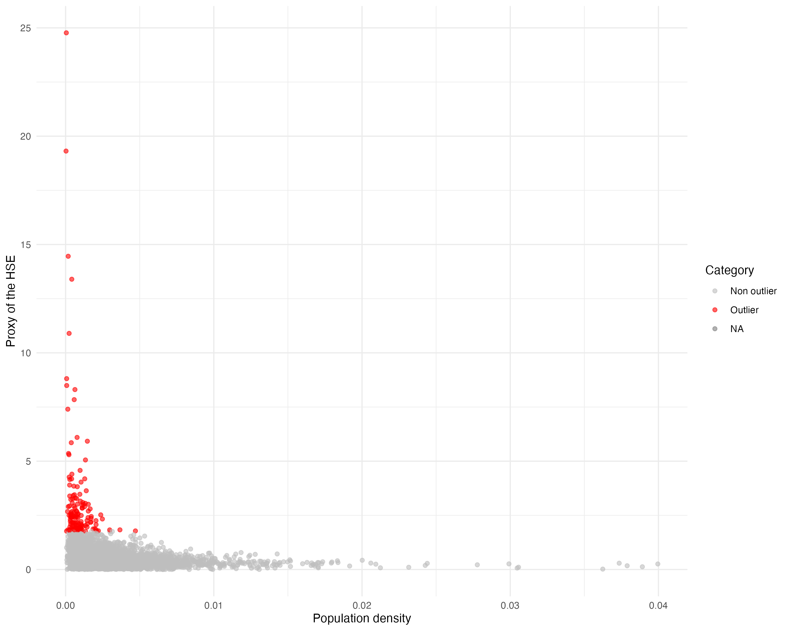
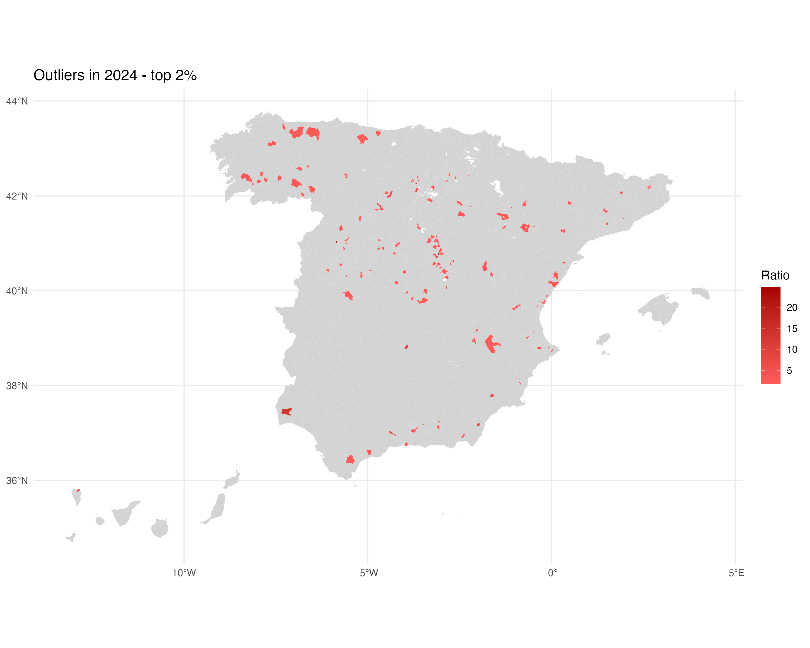
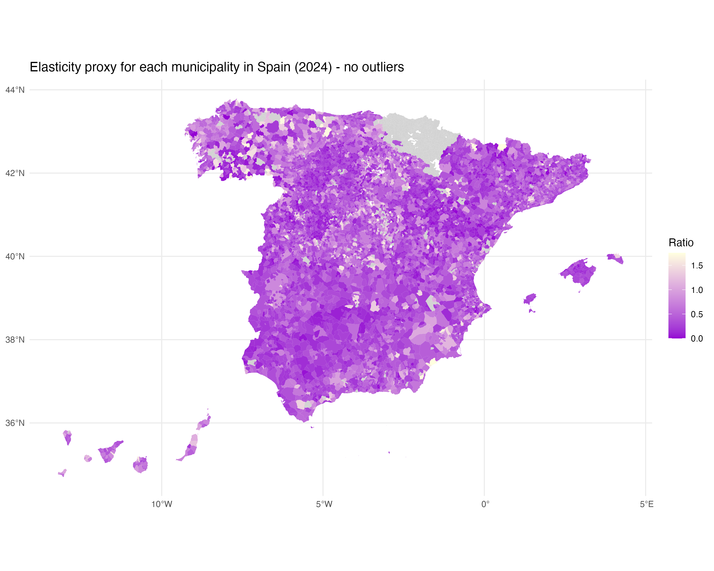
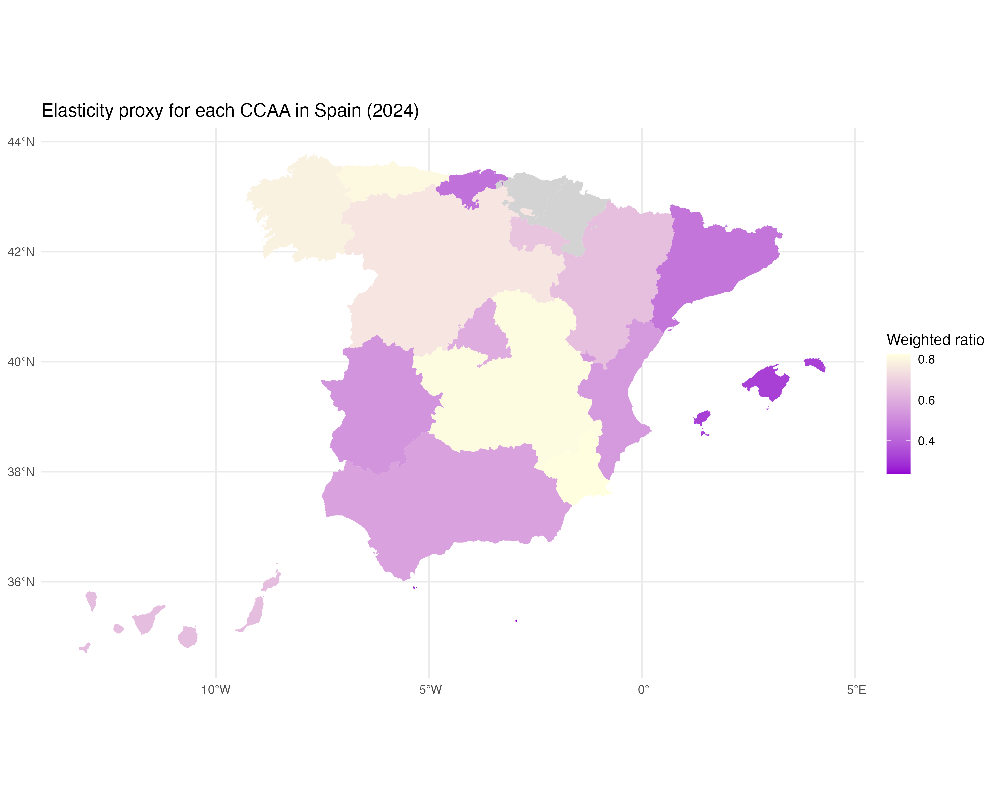
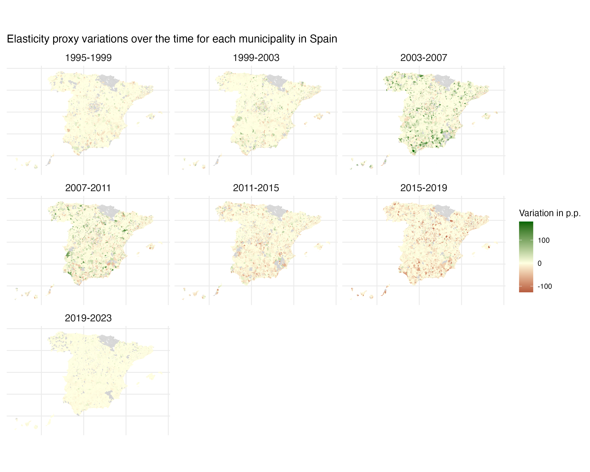
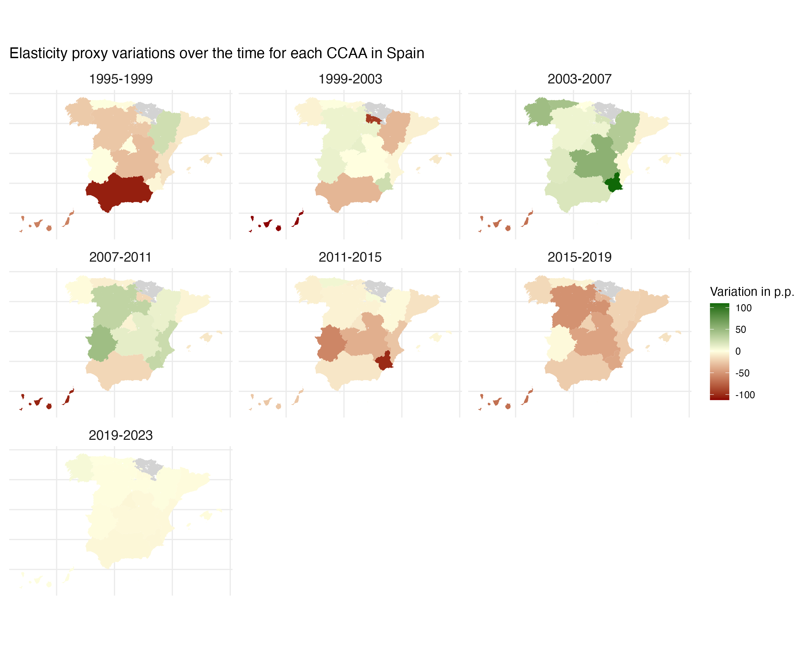
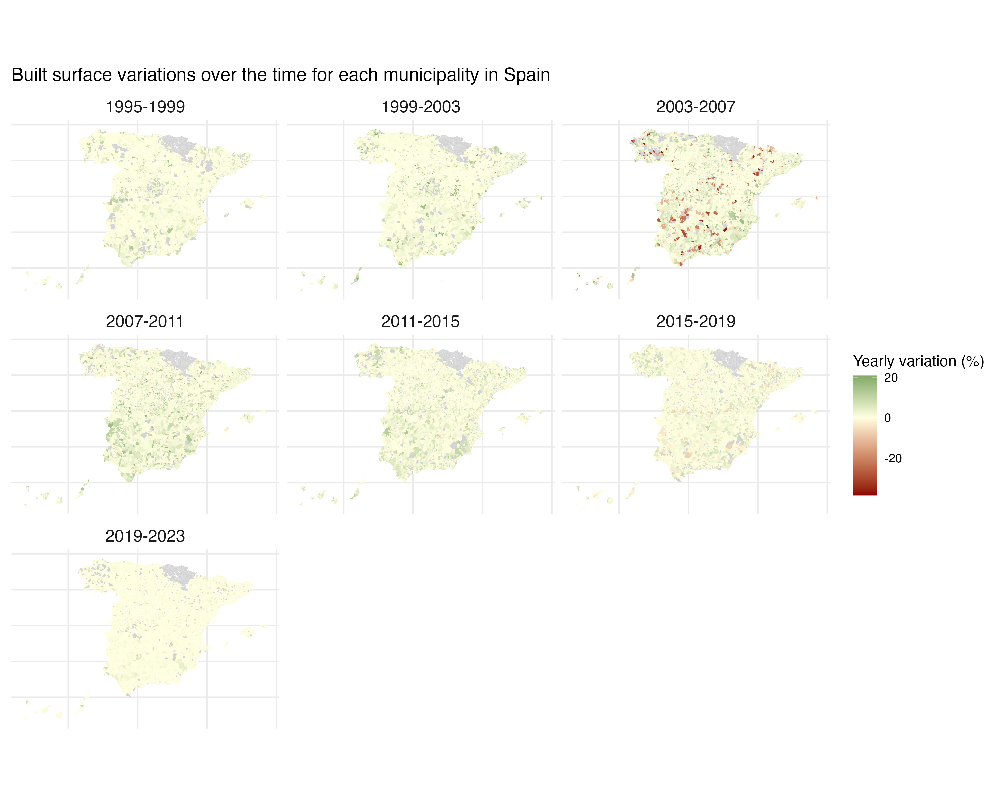
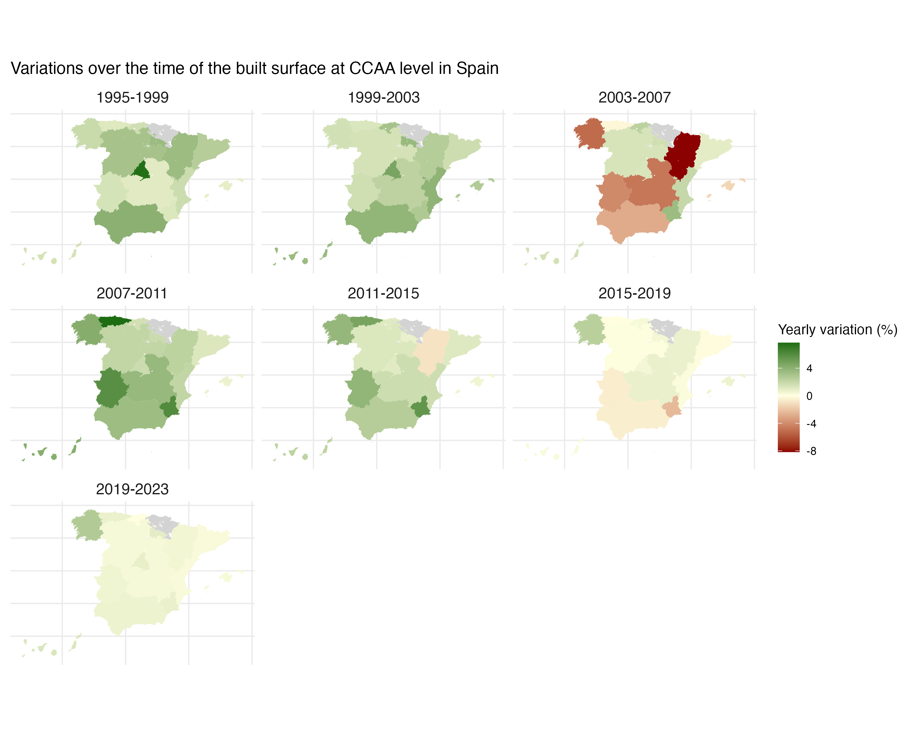
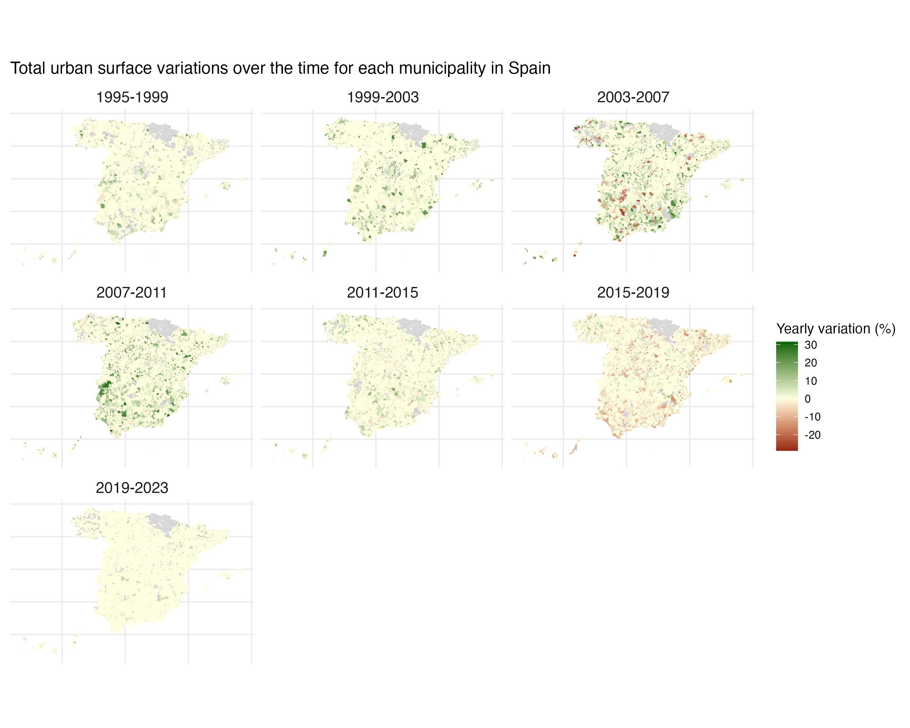
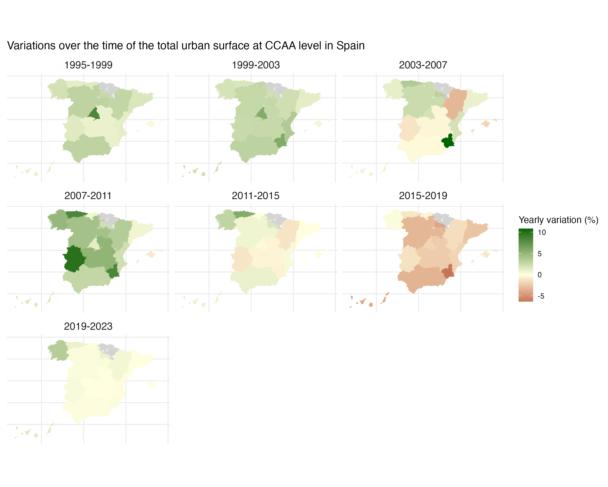

# Introduction

This report studies housing supply elasticity (HSE) in Spain using a proxy based on urban land availability.

The main intuition is that municipalities with larger amounts of potentially developable urban land relative to already built urban surface should be able to respond more easily to housing demand shocks. Conversely, municipalities with limited land availability may face stronger housing supply constraints.

The analysis covers Spanish municipalities and autonomous communities over the period 1994–2024.

*This work was carried out during a research assistantship at the University of the Balearic Islands.*

# Data and methodology

The dataset combines cadastral information on urban land with municipal geographic boundaries obtained through the `mapSpain` package in R.

The main proxy is defined as:

$$
HSE_{it} = \frac{\text{Potentially buildable urban land}_{it}}{\text{Built urban surface}_{it}}
$$

where $i$ denotes the municipality and $t$ denotes the year.

The dataset includes:

- municipality and autonomous community identifiers;
- built urban surface;
- total urban surface;
- potentially buildable urban land;
- yearly values of the HSE proxy.

# Outlier analysis

The distribution of the proxy contains some extreme values, especially among low-density municipalities. These cases are likely driven by municipalities with very small built surfaces or unusually large amounts of available land.

# Housing supply elasticity in 2024

The following maps show the spatial distribution of the HSE proxy in 2024.

The top 2% of values are treated as outliers in order to improve readability.

## Outliers

{width=80%}

## Municipal-level map without outliers

{width=80%}

## Autonomous community level

Municipal ratios are aggregated using total urban surface as weights:

$$
WR_i = \frac{\sum_{j \in M_i} r_j s_j}{\sum_{j \in M_i} s_j}
$$

where:

- $M_i$ is the set of municipalities belonging to autonomous community $i$;
- $r_j$ is the municipal HSE proxy;
- $s_j$ is the municipal total urban surface.

# Temporal dynamics

The report also analyzes the evolution of the HSE proxy across four-year periods between 1995 and 2023.

Changes in the proxy are measured in percentage points:

$$
\Delta HSE_{it} = (HSE_{it} - HSE_{i,t-4}) \times 100
$$

## Municipal-level variation

## Autonomous community variation

# Urban surface dynamics

To complement the HSE proxy, the report studies the evolution of:

- built urban surface;
- total urban surface.

For these variables, yearly growth rates over four-year periods are computed as:

$$
g_{it} = \frac{1}{4} \left( \ln X_{it} - \ln X_{i,t-4} \right) \times 100
$$

where $X_{it}$ represents either built surface or total urban surface.

## Built surface

### Municipal level

### Autonomous community level

# Total urban surface

## Municipal level

## Autonomous community level

# Conclusion

The analysis reveals substantial spatial heterogeneity in housing supply elasticity across Spain.

Municipalities and autonomous communities differ significantly in the availability of developable urban land relative to already built surface. The temporal maps also highlight uneven patterns of urban expansion and housing supply dynamics over time.

This repository provides a reproducible workflow in R for constructing the proxy, processing spatial data, identifying outliers, and generating visualizations.